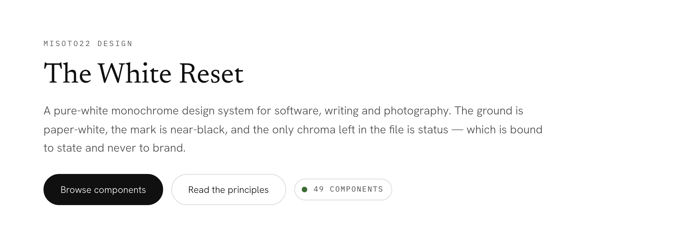
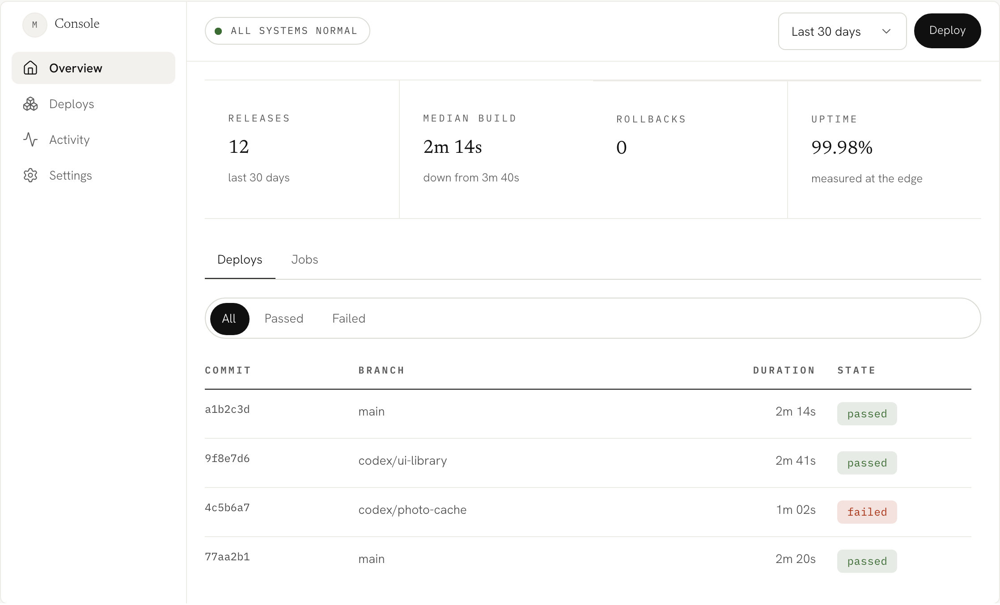
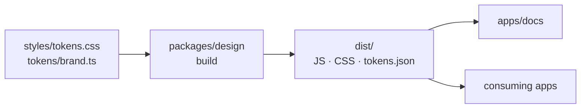

# misoto22 design

<div align="center">

<picture>
  <source media="(prefers-color-scheme: dark)" srcset="assets/hero-dark.png">
  
</picture>

<br />

**The White Reset**

Monochrome design system — CSS tokens and accessible React primitives

<br />

[Documentation](https://ui.misoto22.com) · [中文](https://ui.misoto22.com/zh/) · [Report Issue](https://github.com/Misoto22/misoto22-design/issues)

<br />

[](https://react.dev/)
[](https://www.typescriptlang.org/)
[](https://tailwindcss.com/)
[](https://www.radix-ui.com/)

</div>

---

### Features

- **49 React primitives** — Radix underneath wherever behaviour is involved, `cmdk` for the command palette, `react-day-picker` for the calendar. No router, no state library, no CSS-in-JS.
- **15 data-visualisation primitives**, from a separate entry (`@misoto22/design/charts`) so an app that renders a Badge does not pay for a rendering engine — and four of them (`Heatmap`, `Sparkline`, `BarList`, `BigNumber`) need no engine at all. Texture carries series identity and the grey ramp supports it, which is what keeps two series apart in greyscale print, under forced colours and for a colour-blind reader. Every chart is announced, has an empty state, and puts its rows in a table.
- **Two axes, both attributes** (`data-mode`, `data-density`) — light and dark, comfortable and compact. Set either on any container and everything below it follows.
- **154 tokens, machine-readable** (`@misoto22/design/tokens`) — every token with its light value, dark value, category and comment, as JSON and as a typed module.
- **RTL with no second stylesheet** — every component is written in logical properties, so `dir="rtl"` mirrors the system. A test fails the build on a physical one.
- **Accessibility the build enforces** — `coverage.test.ts` fails when a component has no fixture, so "every component is checked" is a property rather than a claim.

<div align="center">
<picture>
  <source media="(prefers-color-scheme: dark)" srcset="assets/preview-dark.png">
  
</picture>
<br />
<sub>The <a href="https://ui.misoto22.com/templates/dashboard">dashboard template</a> — twelve primitives in one screen, and the only colour on it is state.</sub>
</div>

---

### Tech Stack

<table>
<tr><td><b>Package</b></td><td>React 19 · Radix UI · Tailwind CSS 4.3 · <code>tsup</code></td></tr>
<tr><td><b>Docs site</b></td><td>Next.js 16.3 · TypeScript 6.0 · <code>react-live</code> · static export</td></tr>
<tr><td><b>Testing</b></td><td><code>vitest</code> · Playwright + <code>axe-core</code> (E2E) · esbuild size budget</td></tr>
<tr><td><b>Release</b></td><td>Changesets · npm (<code>@misoto22/design</code>)</td></tr>
<tr><td><b>Deploy</b></td><td>Cloudflare Pages (<code>misoto22-ui</code>)</td></tr>
</table>

---

### Project Structure

The canonical tokens are CSS and TypeScript in `src`. Everything else — the
compiled stylesheet, the JSON, the site's swatches and token tables — is built
from them, which is why `dist/` is never edited by hand.



<details>
<summary>The directories behind that</summary>

```
packages/design/
├── src/
│   ├── components/         49 primitives, one directory each
│   ├── charts/             20 primitives + their shared lib/
│   ├── styles/             tokens.css · semantic.css · keyframes.css
│   ├── tokens/             brand.ts — hex mirrors for non-CSS surfaces
│   └── lib/                cn, control base, overlay container
└── scripts/                font vendoring, portable CSS, token emit, size budget
apps/docs/
├── src/content/            the hand-written part: grouping and summaries
├── src/generated/          parsed out of the package at build time
├── src/templates/          whole screens, not single components
└── e2e/                    axe · keyboard · RTL · density, in a browser
docs/                       component conventions · the site · releasing
```

</details>

---

### Install

```bash
pnpm add @misoto22/design
```

**Prerequisites** — Node.js 24+, React 19 and React DOM 19 as peers

```tsx
// Once, at your app root — the compiled stylesheet carries the tokens, the
// utilities the components use, and the vendored faces.
import '@misoto22/design/styles.css'

import { Button, Field, Input } from '@misoto22/design'
```

<details>
<summary><b>An app that already compiles Tailwind</b></summary>

Take the portable layers instead and skip a second copy of the utilities:

```css
@import 'tailwindcss';
@import '@misoto22/design/tokens.css';    /* primitives  */
@import '@misoto22/design/semantic.css';  /* roles       */
@import '@misoto22/design/keyframes.css'; /* motion      */

@source '../node_modules/@misoto22/design/dist';

@custom-variant dark (&:is([data-mode='dark'] *));
```

</details>

> [!NOTE]
> The mode is an attribute rather than a class so an inline script can write it
> before the first paint and never flash the wrong theme. Density is the only
> other axis: 44px targets by default (what WCAG 2.5.5 asks for), 36px compact
> (which clears 2.5.8 but not 2.5.5, so it is for a dense desktop tool).

---

### Development

```bash
git clone https://github.com/Misoto22/misoto22-design.git
cd misoto22-design
pnpm install
pnpm build:design           # the docs site reads the package from dist
pnpm dev                    # → http://localhost:4023
```

**Prerequisites** — Node.js 24+, pnpm 11+

```
pnpm lint                                        ESLint, both workspaces
pnpm typecheck                                   tsc --noEmit, both workspaces
pnpm test                                        vitest, both workspaces
pnpm build                                       the package, then the site
pnpm --filter @misoto22/design-docs test:e2e     axe + keyboard, in a browser
pnpm --filter @misoto22/design check:size        size and tree-shaking budget
```

The site's Tailwind compiles from the package's *source*, so styling changes are
live; a changed component needs `pnpm build:design` before `pnpm dev` sees it.

---

### Documentation

[ui.misoto22.com](https://ui.misoto22.com) is the gallery, the foundations, the
principles and the templates, in English and — under [/zh](https://ui.misoto22.com/zh/) —
in Chinese. The engineering notes live in [`docs/`](docs/): [component
conventions](docs/component-conventions.md), [the documentation
site](docs/documentation-site.md), [releasing](docs/releasing.md).

Nothing about the library is written twice. Prop tables are parsed out of the
package's TypeScript at build time, token tables out of the CSS, and every
example is a real `.tsx` module that the page renders *and* that the code block
beneath it was read from — so a preview cannot drift from the code printed under
it. The API reference is translated too, and each Chinese entry records a
fingerprint of the English it was made from: editing a doc comment in the
package fails the build until the translation beside it is updated, rather than
quietly telling a Chinese reader something that stopped being true.

The site also serves itself to a reader that does not render CSS —
[`/llms.txt`](https://ui.misoto22.com/llms.txt) as an index,
[`/llms-full.txt`](https://ui.misoto22.com/llms-full.txt) inline, and one file
per component. Not a scrape of the HTML: the same generated data the pages read,
arranged for one sequential pass.

---

### Release

Every consumer-visible change ships with a changeset. Pushing to `main` opens a
version pull request that collects the pending ones, and merging it publishes.

```bash
pnpm changeset
```

Below `1.0.0` this package is still treated as if SemVer's guarantees held: a
removed export, a changed default, or a token that no longer resolves is a
`major`. See [docs/releasing.md](docs/releasing.md).

---

### Deployment

Pushing to `main` runs lint, typecheck, tests, both builds and the browser
suite, then publishes the static export to the `misoto22-ui` Cloudflare Pages
project and smoke-tests the deployed routes. `ui.misoto22.com` is a proxied
CNAME onto that project.

---

### What this repository does not own

The primitives serve both misoto22.com and its admin console, and neither host's
routes, data access or business logic lives here. A component that needs to know
about a route, a session or a database has been built in the wrong repository.

This package is also the source for the **misoto22** Claude Design project — run
the `/design-sync` skill from the repository root to push verified components up,
after the local gates pass. See [`.design-sync/NOTES.md`](.design-sync/NOTES.md).

---

<div align="center">
<sub>Built by Henry Chen · MIT</sub>
</div>
